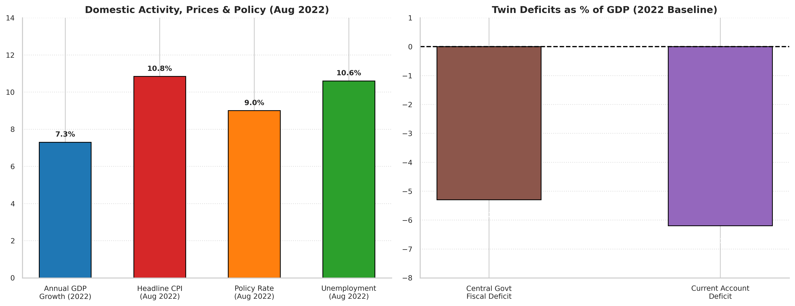
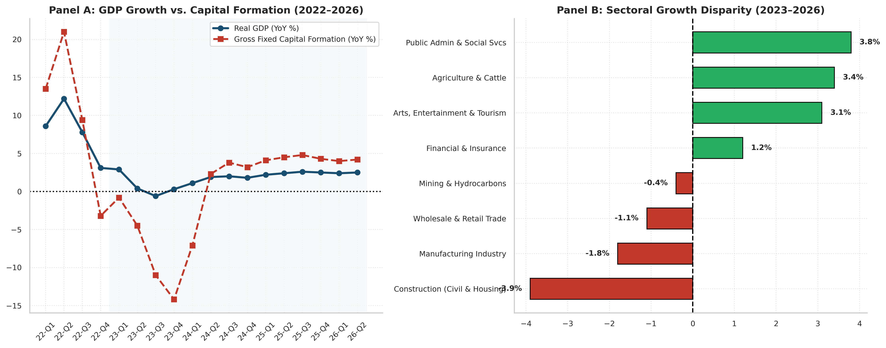
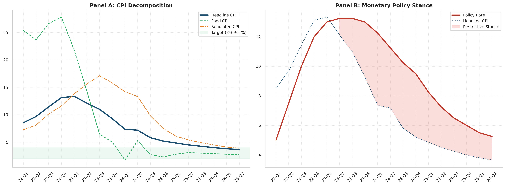
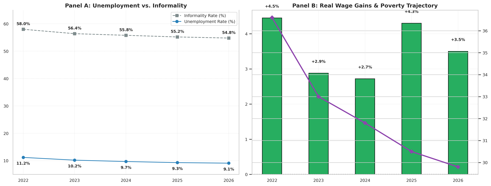
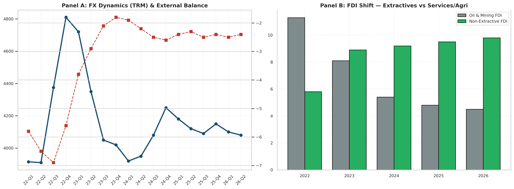
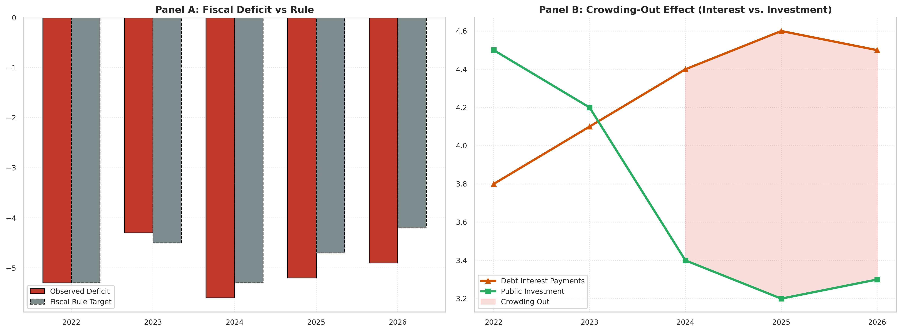
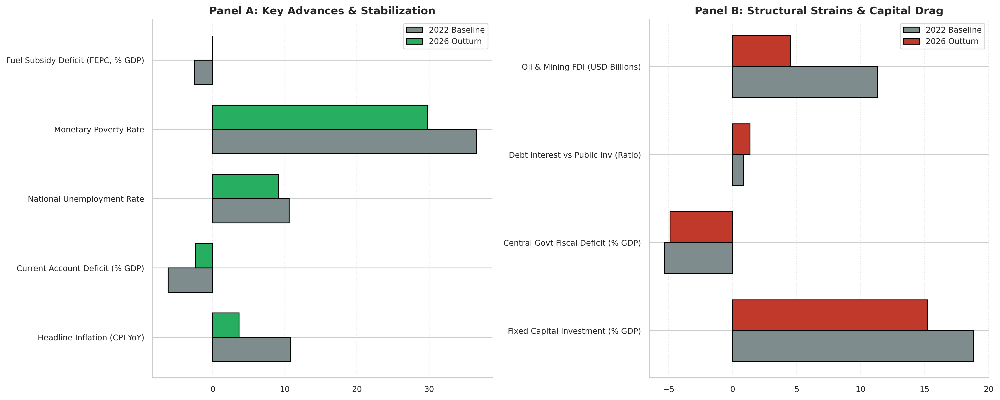

# Colombian Macroeconomic Review (2022–2026): Structural Shifts, Policy Trade-Offs, and Key Indicators

[](https://www.python.org/)
[]()
[]()
[]()

## Executive Overview
This project presents an empirical macroeconomic assessment of Colombia during the presidential administration of Gustavo Petro (August 2022 – August 2026). 

The central thesis of the evaluation demonstrates that Colombia's macroeconomic path did not experience an outright collapse or an industrial leap; rather, it navigated an intense structural tension between **accelerated social redistribution** and **depressed private capital formation**.

Utilizing official time series from primary statistical authorities—the **National Administrative Department of Statistics (DANE)**, the **Central Bank (Banco de la República)**, and the **Autonomous Fiscal Rule Committee (CARF)**—this repository tracks real output, monetary transmission, sovereign debt dynamics, and household welfare indicators.

The empirical findings highlight a defining structural tension: **accelerated social redistribution and poverty reduction** accompanied by **depressed private capital formation and severe fiscal rigidity**.

---

## Macroeconomic Balance Sheet: In-Depth Pros & Cons Matrix

| Dimension | Policy Interventions & Positive Outturns (Pros) | Structural Costs & Lingering Vulnerabilities (Cons) |
| :--- | :--- | :--- |
| **Monetary & Prices** | • **FEPC Unwinding:** Elimination of the regressive ~COP 36T fuel subsidy deficit.<br>• **Disinflation:** Convergence of headline CPI from 13.34% to the ~3.6% target range.<br>• **Institutional Autonomy:** Respected Central Bank independence throughout the tightening cycle. | • **Prolonged Restrictiveness:** Fuel price adjustments kept regulated CPI high, forcing the Central Bank to maintain peak rates (13.25%) longer than regional peers, curbing domestic credit. |
| **Growth & Production** | • **Averted Technical Recession:** Countercyclical public administration spending (+3.8%) and agricultural recovery buffered output during the 2023–2024 slowdown. | • **Investment Slump:** Gross Fixed Capital Formation dropped to ~15% of GDP (vs. historical 21%).<br>• **Contraction in Core Sectors:** Severe multi-quarter slowdown in manufacturing (-1.8%) and housing construction (-3.9%). |
| **Labor & Living Standards** | • **Purchasing Power Expansion:** Consecutive real minimum wage increases (+2.8% to +6.8% in real terms).<br>• **Poverty Compression:** Monetary poverty declined from 36.6% to under 30%.<br>• **Unemployment Containment:** Headline joblessness maintained in single digits (~9.1%–9.7%). | • **The Informality Ceiling:** Informality remained stubbornly entrenched above 54% of the workforce, showing that statutory wage hikes primarily benefited formal payrolls without integrating the informal base. |
| **External & FX Accounts** | • **External Balance Correction:** Current Account deficit narrowed from -6.2% of GDP in 2022 to -2.4%.<br>• **Currency Normalization:** COP/USD recovered from late-2022 overshooting (~COP 5,000) back to the COP 3,900–4,150 corridor.<br>• **Tourism Expansion:** Non-extractive service exports reached record highs. | • **De-investment Compression:** The external balance adjustment was largely driven by compressed imports of capital goods rather than a non-traditional export boom.<br>• **Extractive FDI Decline:** Moratoriums on new exploration contracts cut oil & mining foreign investment by >50%. |
| **Fiscal Accounts & Debt** | • **Tax Reform (Law 2277):** Initial revenue boost and progressive taxation framework introduced in 2022–2023. | • **Fiscal Squeeze & Debt Rigidity:** Central government deficit widened back to -5.6% of GDP in 2024, requiring mandatory spending freezes.<br>• **Capital Crowding Out:** Public debt interest payments (4.6% of GDP) surpassed productive public investment (3.3% of GDP). |

---
## Visual Highlights & Key Empirical Findings

### 1. Macroeconomic Handover Baseline (August 2022)
The administration inherited strong post-pandemic consumption growth alongside severe overheating: double-digit inflation (10.84%), twin deficits (-5.3% fiscal, -6.2% current account), and a massive ~COP 36T fuel subsidy deficit.
<p align="center">
  
</p>

### 2. Output Deceleration & The Capital Investment Slump
While headline GDP avoided a technical recession, Gross Fixed Capital Formation dropped to ~15% of GDP. Core sectors like construction (-3.9%) and manufacturing (-1.8%) weighed down aggregate activity.
<p align="center">
  
</p>

### 3. Disinflation Path & The Central Bank Reaction Function
A sharp drop in food inflation led headline disinflation, while regulated fuel price adjustments kept core stickiness elevated, requiring a prolonged restrictive stance (+400 to +600 bps real policy rate).
<p align="center">
  
</p>

### 4. Labor Market Resilience & Real Minimum Wage Gains
Unemployment remained contained in single digits (~9.1%–9.7%) and real minimum wage increases lowered monetary poverty to under 30%, though labor informality stayed entrenched above 54%.
<p align="center">
  
</p>

### 5. Foreign Exchange Stabilization & FDI Reallocation
After reaching ~COP 5,000 in late 2022, the Colombian Peso appreciated back to the ~4,100 corridor. FDI in oil and mining fell by more than 50%, while non-extractive sectors (services, tech, tourism) expanded.
<p align="center">
  
</p>

### 6. Fiscal Strain & The Public Capital Crowding-Out Effect
By 2024, sovereign debt interest payments (4.6% of GDP) surpassed productive public investment (3.3% of GDP), highlighting structural budget rigidity.
<p align="center">
  
</p>

### 7. Consolidated Executive Scorecard (2022 Baseline vs. 2026 Outturn)
A side-by-side empirical scorecard contrasting macro stabilization and social gains against private capital contraction and fiscal pressures.
<p align="center">
  
</p>

---

## Repository Architecture

```text
├── data/
│   └── colombia_macro_series_2022_2026.csv             # Consolidated time series dataset
├── notebooks/
│   └── colombia_macroeconomic_review_2022_2026.ipynb   # Complete reproducible Colab notebook
├── figures/
│   ├── fig1_baseline_profile_2022.png                  # Figure 1.1
│   ├── fig2_growth_investment_sectors.png              # Figure 2.1
│   ├── fig3_inflation_monetary_policy.png              # Figure 3.1
│   ├── fig4_labor_wages_poverty.png                    # Figure 4.1
│   ├── fig5_fx_external_fdi.png                        # Figure 5.1
│   ├── fig6_fiscal_deficit_crowding_out.png            # Figure 6.1
│   └── fig7_synthesis_scorecard.png                    # Figure 7.1
├── README.md                                           # Project documentation & visual dashboard
└── requirements.txt
```
---

## Tech Stack

* **Python 3.9+**
* **Pandas:** Time series manipulation, data cleaning, and real/nominal deflation.
* **NumPy:** Statistical arrays and numerical transformations.
* **Matplotlib & Seaborn:** Production of executive-grade macroeconomic visualizations.

## Execution and Reproducibility

## Tech Stack

* **Python 3.9+**
* **Pandas:** Time series manipulation, data cleaning, and real/nominal deflation.
* **NumPy:** Statistical arrays and numerical transformations.
* **Matplotlib & Seaborn:** Production of executive-grade macroeconomic visualizations.

## Execution and Reproducibility

1. Clone the repository:
```bash
git clone [https://github.com/georgepm31-lab/colombia-macroeconomic-review-2022-2026-Gustavo-Petro-government.git](https://github.com/georgepm31-lab/colombia-macroeconomic-review-2022-2026-Gustavo-Petro-government.git)
cd colombia-macroeconomic-review-2022-2026-Gustavo-Petro-government
```

2. Install required dependencies:

```bash
pip install -r requirements.txt
```

3. Run the notebook:

```bash
jupyter notebook notebooks/colombia_macroeconomic_review_2022_2026.ipynb
```

Primary Data Sources
DANE (Departamento Administrativo Nacional de Estadística): Cuentas Nacionales Trimestrales, ISE, IPC, Gran Encuesta Integrada de Hogares (GEIH).

Banco de la República de Colombia: Tasa de Intervención de Política Monetaria, TRM, Balanza de Pagos, Flujos de IED.  

Ministerio de Hacienda y Crédito Público / CARF: Marco Fiscal de Mediano Plazo, Informes del Comité Autónomo de la Regla Fisc
Author
Jorge Enrique

Data Science & Macroeconomic Analytics

GitHub Profile
